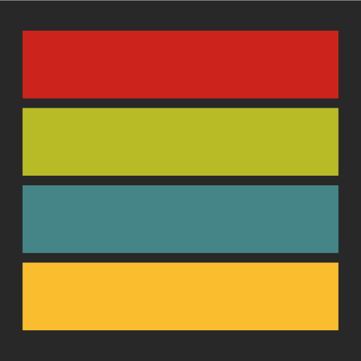

# GruvBox theme for raymp

<p align="center">
  
</p>

# Previews
| Dark | Light |
| --- | --- |
|  |  |

# Install
- copy the cloned in `.rmp/plugins` folder

# Configurations
```lua
{
    "rose-pine-rmp",
    -- config
    {
        VARIANT = "dark" --"dark" "light"
    }
}
```
- disable theme from settings config
